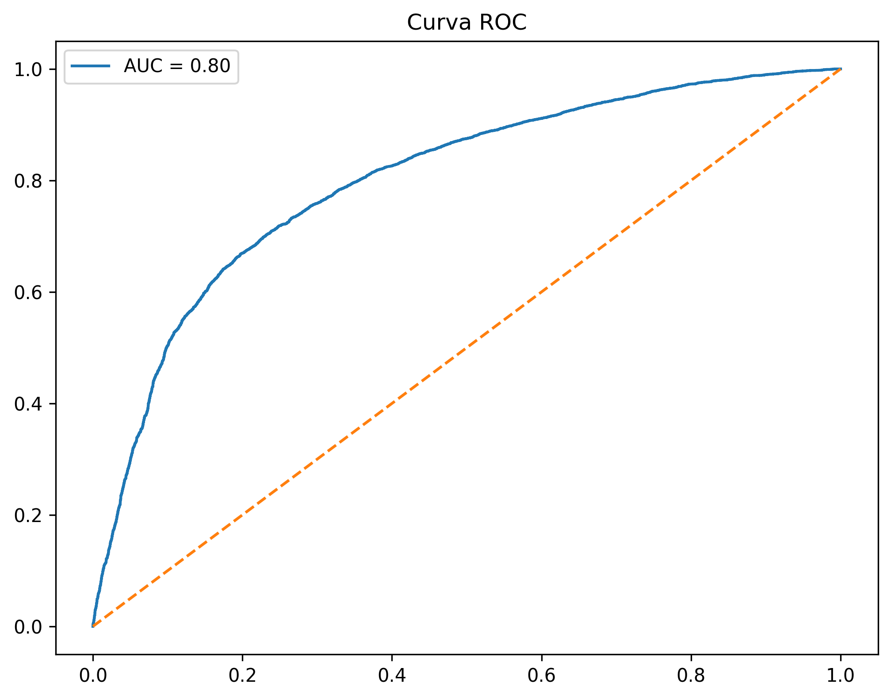
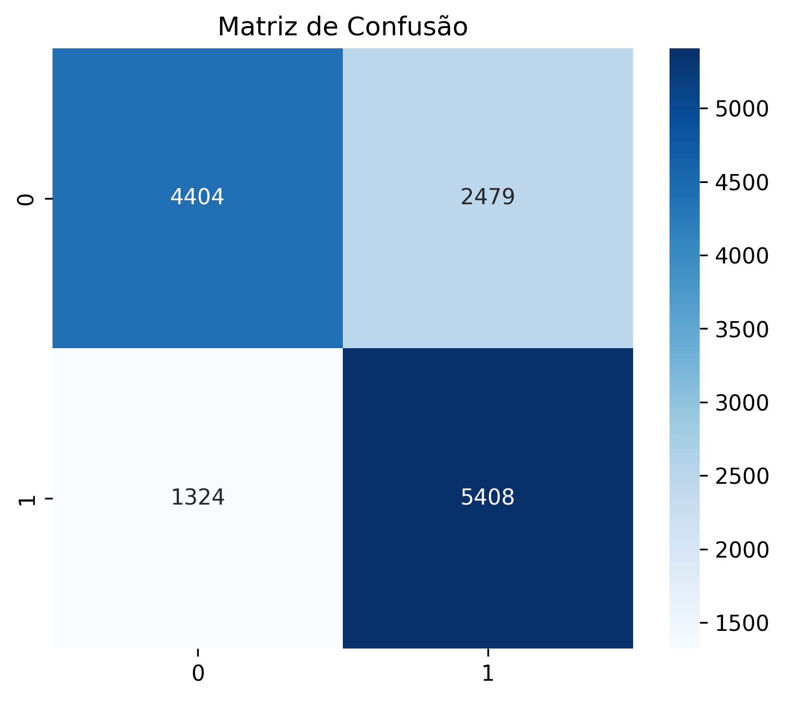
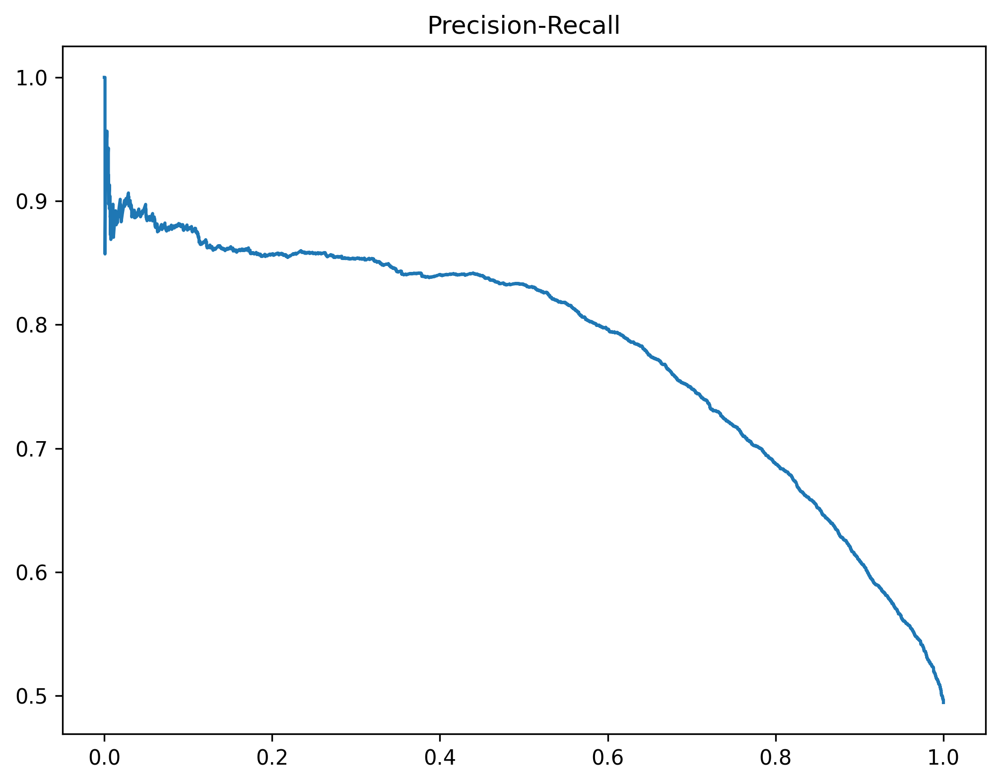
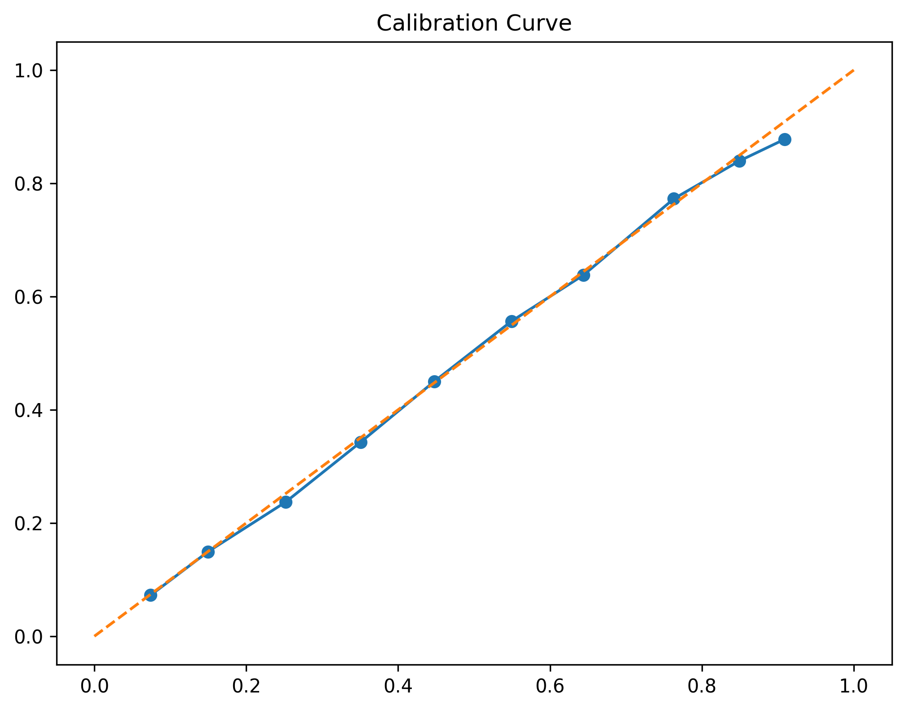
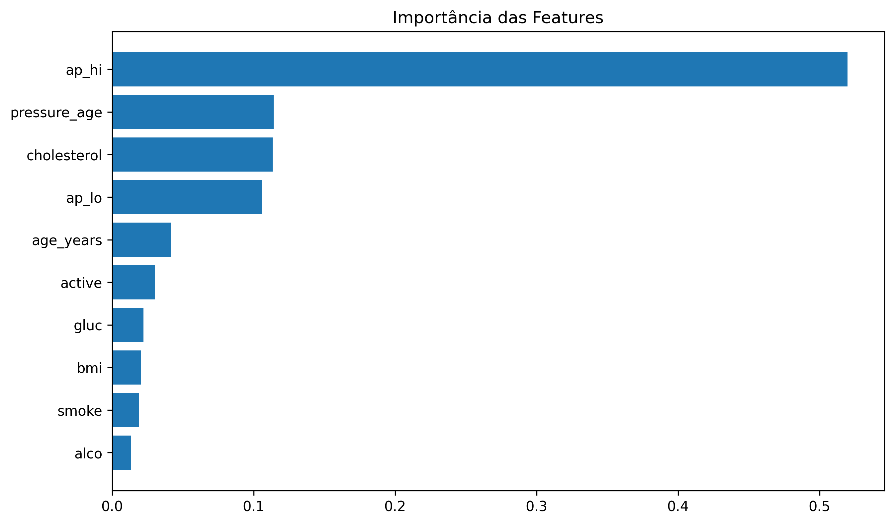
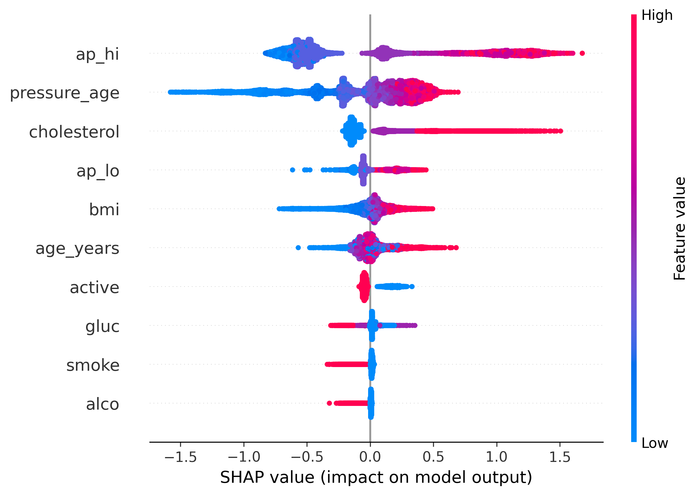

Predição de AVC com Machine Learning

Projeto desenvolvido na pós-graduação com foco em análise de dados e modelos de classificação para prever risco de AVC.

Tecnologias
- Python
- Pandas
- Scikit-learn
- XGBoost
- SHAP
- Streamlit

Etapas do Projeto
- Limpeza de dados
- Feature engineering (BMI, idade, pressão)
- Treinamento do modelo
- Avaliação (Acurácia, ROC, AUC)
- Interpretabilidade com SHAP

Resultados
- Acurácia: 72%
- AUC: 0.80
- F1-score: 0.73
- Recall: 0.80
O modelo apresentou bom desempenho na identificação de casos positivos, com destaque para o alto recall, importante em cenários de saúde.

## Visualizações do Modelo

### Curva ROC
A curva ROC demonstra a capacidade do modelo em distinguir entre as classes.  
O AUC próximo de **0.80** indica um bom poder de separação.



---

### Matriz de Confusão
A matriz de confusão evidencia o comportamento do modelo nas classificações.  
Observa-se um foco em **alto recall**, reduzindo falsos negativos — fator crítico em cenários médicos.



---

### Precision-Recall
A curva Precision-Recall mostra o equilíbrio entre precisão e recall.  
Esse gráfico é especialmente relevante em problemas com classes desbalanceadas.



---

### Calibration Curve
A curva de calibração avalia o quão bem as probabilidades previstas refletem a realidade.  
Um bom alinhamento indica previsões confiáveis.



---

### Importância das Features
Mostra quais variáveis mais influenciam o modelo.  
Ajuda na interpretação e validação do comportamento do algoritmo.



---

### SHAP (Interpretabilidade)
A análise com SHAP permite entender o impacto de cada variável nas previsões do modelo.  
Isso traz **transparência e explicabilidade**, fundamentais em aplicações de saúde.



**Nota:** O modelo foi otimizado para priorizar recall, reduzindo o risco de não identificar casos positivos, o que é essencial em aplicações médicas.

### Como rodar

```bash
pip install -r requirements.txt
streamlit run app/app.py
