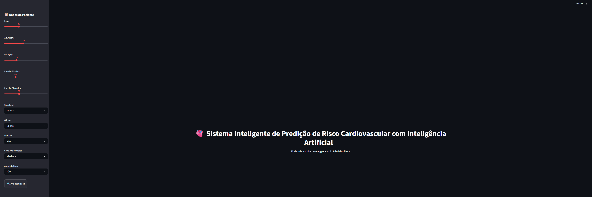

# Sistema Inteligente de Predição de Risco Cardiovascular com IA

Aplicação interativa baseada em Machine Learning para prever o risco de doenças cardiovasculares a partir de dados clínicos.

O sistema permite simulações em tempo real e fornece explicações sobre os fatores que mais influenciam o risco, contribuindo para análises mais transparentes e interpretáveis.

---

##  Preview da Aplicação

---

## 🚀 Funcionalidades

-  Predição de risco cardiovascular em tempo real
-  Classificação: Baixo, Médio ou Alto risco
-  Visualização dos principais fatores (feature importance)
-  Interpretabilidade com SHAP (explicabilidade do modelo)
-  Curva ROC, Precision-Recall e matriz de confusão
-  Interface interativa com Streamlit

## Tecnologias
- Python
- Pandas
- Scikit-learn
- XGBoost
- SHAP
- Streamlit

## Etapas do Projeto
- Limpeza de dados
- Feature engineering (BMI, idade, pressão)
- Treinamento do modelo
- Avaliação (Acurácia, ROC, AUC)
- Interpretabilidade com SHAP

## Resultados
- Acurácia: 72%
- AUC: 0.80
- F1-score: 0.73
- Recall: 0.80
O modelo apresentou bom desempenho, com foco em alto recall, reduzindo falsos negativos — fator crítico em aplicações médicas.

## Visualizações do Modelo

## Curva ROC
A curva ROC demonstra a capacidade do modelo em distinguir entre as classes.  
O AUC próximo de **0.80** indica um bom poder de separação.

---

## Matriz de Confusão
A matriz de confusão evidencia o comportamento do modelo nas classificações.  
Observa-se um foco em **alto recall**, reduzindo falsos negativos — fator crítico em cenários médicos.

---

## Precision-Recall
A curva Precision-Recall mostra o equilíbrio entre precisão e recall.  
Esse gráfico é especialmente relevante em problemas com classes desbalanceadas.

---

## Calibration Curve
A curva de calibração avalia o quão bem as probabilidades previstas refletem a realidade.  
Um bom alinhamento indica previsões confiáveis.

---

## Importância das Features
Mostra quais variáveis mais influenciam o modelo.  
Ajuda na interpretação e validação do comportamento do algoritmo.

---

## SHAP (Interpretabilidade)
A análise com SHAP permite entender o impacto de cada variável nas previsões do modelo.  
Isso traz **transparência e explicabilidade**, fundamentais em aplicações de saúde.

**Nota:** O modelo foi otimizado para priorizar recall, reduzindo o risco de não identificar casos positivos, o que é essencial em aplicações médicas. 

## Estrutura do Projeto
sistema-predicao-risco-cardiovascular/
│
├── app/                # Interface Streamlit
├── data/               # Dataset
├── model/              # Modelo treinado
├── assets/             # Imagens e gráficos
├── notebooks/          # Análises exploratórias
├── requirements.txt
└── README.md 

## Observação
O modelo foi otimizado para priorizar o recall, reduzindo o risco de não identificar pacientes com potencial problema cardiovascular — abordagem essencial em cenários de saúde.

## Como Executar o Projeto

# Criar ambiente virtual
python -m venv venv

# Ativar ambiente (Windows)
venv\Scripts\activate

# Instalar dependências
pip install -r requirements.txt

# Executar aplicação
python -m streamlit run app/app.py 

Autor

## João Roberto Godoy Rodrigues
Projeto desenvolvido para pós-graduação em Inteligência Artificial. 

## 🌐 Acesse a aplicação online

🔗 https://seu-app.streamlit.app
